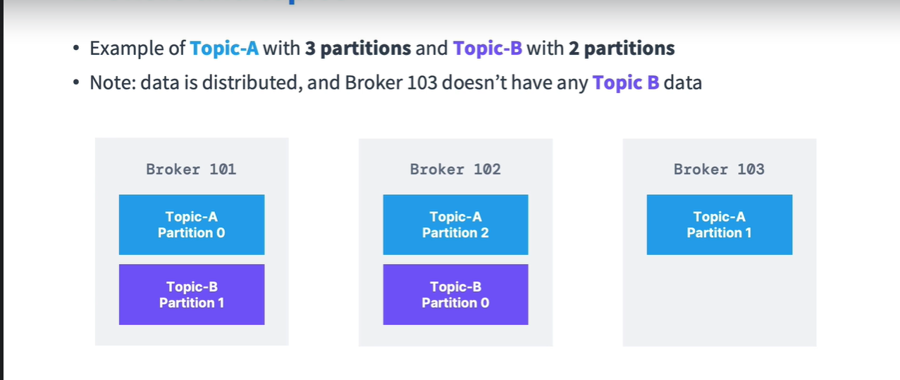

# apache-kafka v3.x ([Courtesy](https://www.udemy.com/course/apache-kafka/learn/lecture/11567174#learning-tools))

## Kafka Theory
- Why Pull Model
  - Impedence misMatch :If Producer is faster than consumer, But still Broker can health-check and push to the right instance
  - Offset Tracking : With pull model the onus is on consumer to track offset & resume pulling with new consumers
- What Guarantee kafka provides, which this while designing system
  -  Default at-least once
  -  Order within partition w/ configurations. Read below, how w/ async send() you can achieve Ordering
- Message in a partition gets an id, called Offset. Offset read is possible unlike JMS
- Kafka logs are immutable & append-only
  - so topics can be easily replicated
  - By restricting operations to appending data at the end of the log, Kafka minimizes disk seek times, which are a major bottleneck in many storage systems.
- JMS vs Kafka
  - JMS ; message deleted once read unlike topic
  - JMS : waits for consumer to ack the message read & sends next message, whereas kafka lets consumer to keep track of messages via offset
- Message Queue vs kafka
  - Event gets deleted from Traditional Q or topic once consumed. Kafka persists until event expires(Default 1 week)
  - Traditional Q FIFO, offset seek not possible
  - In Queue, one consumer subscribes queue & gets data
  - Queue is Point-to-Point communication, whereas Kafka stream is Pub-Sub communication
- Kafka Message Format
  - [Format](kafkaMessageFormat.png)
  - Contains `TimeStamp`
  - Key can be numeric or string or anything 
  - If event has no key, events distributed across partition in round-robin fashion. If event has key, hash(key)%partitionSize => decides which partition that event goes into
    - Murmur2 algo for Hashing
    partition# = Math.abs(Utils.murmur2(keyBytes)) % (partitionSize)
    - Producers decide which partition data is written into by using Key
  - No key Advt
    - Even distribution across partition
  - Having key Advt:Ordering of events of similar key in a partition ,as events with same key goes into same partition always
  - `Best Practices`
    - Consistent hashing can be using for mapping key to partition
    - Avoid Hot Parition by adding salt or using combination of keys as key etc 
- Kafka serializer/Deserializer
  - Producer can send in any format and kafka only accepts byte format, That's why kafka serializer. Example, 
    IntegerSerializer, StringSerializer
  - `Best Practice`: In a topic life cycle, don't change the format of data in that topic, else would break consumers 
- Consumer Group
  - Consumers in a group read from `Exclusive` partitions of a topic
  - [Multiple CG per Topic](MultipleConsumerGroupsPerTopic.PNG)
  - Consumer has a property called "group.id"
- Consumer Offset
  - Kafka has a mechanism to tell till which offset a consumer of a group has read the partition. It's stored in an 
    internal kafka topic called `__consumer_offsets`
  - How it works 
    - Consumer from a group `periodically` commits offset while consuming data and Kafka writes the offset to the 
      `__consumer_offsets` topic
    - If a consumer dies, another is spawn, it can resume reading from the same offset where previous consumer died.
- Producer Delivery Semantics(How producer can choose to rcv ACK from broker)
  - ACKS=0, producer won't wait for ACK(Possible data loss)
  - ACKS=1, producer wait for ACK from leader broker(limited data loss), so producer can retry
  - ACKS=-1 or all(Default), producer wait for ACK from  min.insync.replicas, Ensurers replication happens before ACK(No data 
    loss)

- Sync send() & async send() in Kafka & Myths of Order Preservation
  - Technically, producer always sends to broker asynchrounously. sync send() api means `producer.send(event1).get(), Then producer.send(event2).get()`
  - What is sync send(event) : Get ack for the message(So, batch.size & linger.ms timeout is not more relevant)
  - What is async send(event, callback) : send() is not blocked & callback will be called in producer thread itself when ack comes from broker
  - Both relevant for above "ACKS" types
  - Ordering
    - sync send() ensures ordering
    - async send() have few flavors of send mechanism.  
    If batching is used, then whole batch fails or succeeds. Retry also retries whole batch if send fails or ack from broker fails 
    Other flavor is If `max.in.flight.per.connection` is used(which means max unacknowledged batches producer can send before ack), Order might fail. i.e. batch2 is successful , but batch1 fails & retried post that. How to fix this ? `idempotent Producer` + `retries  > 0` + `acks=all` fixes this. `idempotent Producer` sends a seq number with each message, which broker uses to de-dup or maintain order of last 5 batches(if max.in.flight.per.connection = 5). Then broker commits & consumer only sees the commited data, which is already ordered.  

- Consumer Delivery semantics (When consumer commits offset)
  - `At most once`: Commits offset once message `received`
    - Implication
      - if processing fails, message lost, can not be re-read
    - High throughput and less latency
  - `At least once`(Preferred): Commits offset once message `received + processed`
    - Implication
      - Possibility of reading the message more than once.
      - `Best practice` Make the consumer processing idempotent,i.e. Processing same message again should not impact system. Idempotency can be achieved by de-duplication.
    - Moderate throughput and Moderate latency
    - java sdk by default uses this
  - `Exactly once`
    - For [ConsumeFromTopic1-process-ProduceToTopic2](https://media.licdn.com/dms/image/v2/C4E12AQGkGEd6dGlRPQ/article-inline_image-shrink_1500_2232/article-inline_image-shrink_1500_2232/0/1645268711847?e=1730937600&v=beta&t=4GZK5WeprMzzZhdrQgEsG-BgmOc6F4WWXb0qIPUL1bE) usecase, By using `Kafka Transaction`, so that down-stream consumer(i.e. consumer of Topic2) receives `exactly once`
    - [Refer LinkedIn Post](https://www.linkedin.com/feed/update/urn:li:activity:6900760920604106752?updateEntityUrn=urn%3Ali%3Afs_updateV2%3A%28urn%3Ali%3Aactivity%3A6900760920604106752%2CFEED_DETAIL%2CEMPTY%2CDEFAULT%2Cfalse%29&lipi=urn%3Ali%3Apage%3Ad_flagship3_myitems_savedposts%3BP%2BEmBT8yRtKDfGSCR1HmLQ%3D%3D)
    - Things to Learn
      - `Idempotent Producer` means message to be there in broker exactly-once & Ordering should be preserved. Challenges: A message send may fail or a ACK might fail even after storing in broker. [How to make Producer Idempotent, Only with configurations, But learn the concepts. Broker can reject the dup message or re-order last n messages based max.in.flight.per.connection = n setting](https://www.linkedin.com/pulse/kafka-idempotent-producer-rob-golder/). [Configurations](https://media.licdn.com/dms/image/v2/C4D12AQGw0RIaghNN5A/article-inline_image-shrink_1500_2232/article-inline_image-shrink_1500_2232/0/1637697739516?e=1730937600&v=beta&t=2yyQNBZ_rR5239K2YbREiM54edf3yvGB57TXVb5GuFk)        
      -  `Idempotent consumer` means no impact at consumer even if dup message is received . How to make consumer Idempotent? Use De-Dup Pattern.
      -  If a consumer process data by inserting to DB & sends the data further to next topic, How to make DB txn + Send to Kafka Topic txn atomic. By [Transaction Outbox](https://docs.aws.amazon.com/prescriptive-guidance/latest/cloud-design-patterns/transactional-outbox.html). Basically persist data in `Outbox event` Table before sending to nest topic
    -  How to use `kafka transaction` to make ConsumeFromTopic1-process-ProduceToTopic2 atomic
        -   Consumer of Topic1 should be Idempotent & use Txn Outbox Pattern to send to Topic2
        -   Producer of Topic2 should be Idempotent & Begin a kafka txn
        -   Send consumer offsets information of Topic1 to above Producer, so that they will be part of Txn
        -   Producer Commits Txn, So Topic1 consumer marks the n messages as processed & these n messages are sent to Topic2
        -   Make Consumer of Topic2 READ_COMMITED isolation level
- Kafka Cluster & broker
  - Each kafka server or node -> Broker. If more than one broker, Kafka is called cluster
  - Broker contains partition of different topic,i.e. n partitions of a topic can be distributed in different 
    brokers. This is horizontal scaling.
  
- Kafka Broker discovery(As different broker has data of different topic-partition, How client how know this info and 
  connect to appropriate broker)
  - Kafka client needs to connect to any kafka broker and the rest follow. This "any broker" is `Bootstrap broker`. 
    All brokers eligible to be bootstrap broker
  - [kafka Broker Discovery](KafkaBrokerDiscovery.png)
- Difference between a topic and a partition
  - A topic is a logical grouping of messages. A partition is a physical grouping of messages. A topic can have multiple partitions, and each partition can be on a different broker. Topics are just a way to organize your data, while partitions are a way to scale your data.
  - Partitions are distributed across broker for better load-handling
- Assignments in Kafka
  - Partition-Broker, Kafka handles if for better load-handling
  - Key-partition, Developer can define "Key", which decides which message goes to which Partition
  - Consumer-Partition, Developer can control the algo how this assignment happens
- Topic replication factor
  - For redundancy/replication. If a broker goes down, then another broker can have to data of partition
  - [Topic Replication](TopicReplication.png)
  - If brokers# < replication factor, Kafka throws error. `Partitions reassignment failed due to replication factor: 45 larger than available brokers: 21` 
  - `Topic Availability`: Let's assume replication factor < brokers#, for N replication factor, topic can withstand N-1 
    broker failures.
    Example, 2 topics , Each of 2 partitions, Replication Factor=2 & brokers#=2, Then if one broker goes down , the 
    2nd broker becomes leader for all partition of both topics
- Partition Leader
  - Now we have replicas of partition, only one broker can be a leader of a particular partition
  - Rules
    - Producer writes to `only` broker that's leader of partition
    - Consumer reads from `by default` broker that's leader of partition. But kafka 2.4+ version, consumer can fetch data from ISR partitions, which can be configured via `replica.selector.class` to let developer chooser which broker will serve Read
  - SO, each partition has leader and ISR(in-sync-replica) or OSR(out-sync-replica)/if replication ha not happened
- Apache Zookeeper
  - ZK is [:face_with_spiral_eyes: centralized, yet distributed](https://medium.com/nakamo-to/whats-the-difference-between-decentralized-and-distributed-1b8de5e7f5a4) service which acts like 
    distributed system coordinator, discovery/naming service
  - Kafka Dependency on ZK
    - Kafka 2.x can't work w/o ZK, even for single broker setup
    - Kafka 3.x can work w/o ZK, using `Kafka Raft(KIP-500)`, i.e. KRaft
    - Kafka 4.x won't have ZK
    - Managing kafka Broker
      - Until 4.x, should not use kafka w/o ZK in Production. KRaft in 3.x not prod-ready yet
    - Managing Kafka Client
      - Since 2.2 all clients/CLI already migrated to leverage brokers instead of ZK, so don't use ZK for managing 
        clients, i.e. for a producer or consumer to connect, it just needs to know any broker + topic name. [Refer](KafkaBrokerDiscovery.png)  
  - [ZK also is distributed, has leader/follower nodes](ZK_Cluster.PNG)
  - Roles of ZK managing Broker & Clients
    - Wrt kafka Broker
      - Broker Leader Election
      - ACL and quotas stored
      - State of brokers - Keeps polling brokers
      - Broker/Topic Registry: Can Find all broker/partition/topic details from zookeeper
    - Wrt Kafka Client
      - < v0.10 used to store consumer offset
      - Consumers register to ZK. So, can find all consumers in cluster
- Why KRaft
  - ZK scaling issue when cluster has >1L partitions
  - Difficult to manage two system from admin point of view
  - Single security model if ZK removed
  - [ZK Centralized vs KRaft Decentralized](KRaft_Architecture.PNG), i.e. one of broker acts as quorum leader

## Kafka Installation
- [Refer PDF for flow](Install+Kafka+Diagram.pdf)
- [Refer for Different platform installation](https://www.conduktor.io/kafka/starting-kafka)
- Windows
  - Kafka not supposed to on native windows, run either on VM or Docker

## Kafka CLI
- Use --bootstrap-server instead of --zookeeper, as all CLI commands upgraded to work w/o ZK
- [Refer](udemy-part1/1-kafka-cli)
- Producing to a non-existing topic, Kafka creates a topic for you with replication factor=1, partition=1
- Kafka consumer by default reads from end of topic, to read from beginning specify `--from-beginning`
- If a consumer reading w/o group, Kafka creates a CG with name `console-consumer-[0-9+]`. But unlike actual groups, 
  if consumer die, this special CG is removed so consumer offset not maintained for this CG
- [How Consumer Group looks](CG_Describe.png)
- Offset seek/Tweaking so that consumer can read differently than ordered reading
  - Done at CG command using `kafka-consumer-groups`, not consumer command
  - `--reset-offsets --to-earliest --execute --topic topic.name` (Will re-read from beginning for each partition of 
    that topic)
  - `--reset-offsets --shift-by 2 --execute --topic topic.name` (Will skip 2 offsets for each partition of that topic)

## Kafka SDK
- Official SDK is java SDK, i.e. apache-kafka-clients
- Examples of the course
  - Producer async send with or w/o keys
  - Producer with callback and exception handler
  - `StickyPartitioner`
    - Ideally when no key for a message, messages should be sent ot partitions in a round-robin fashion, But for 
      optimization purpose, messages are sent batches if sent with less time gap to same partition. This is 
      StickyPartitioner behavior. 
    - How to break this behavior ?? (Just for testing, but sticky is better and performant)
      - Just add a sleep between sending messages, It would send to partition in round-robin
  - Consumer with :infinity: loop polling and no graceful exit
    - :face_with_spiral_eyes: A consumer can listen to multiple topics, offset commit would determine how much of 
      each topic/partition read
  - [Consumer with :infinity: loop polling and graceful exit](./udemy-part2/kafka-basics/src/main/java/io/conduktor/demos/kafka/ConsumerDemoWithShutdown.java)
  - `Partition re-balancing` with multiple consumers of a CG[1 topic, 3 partitions]
    - `When happens`
      - when partition added/removed/considered DEAD(because of long-running process) or consumer added/removed of a CG
    - Steps
      - 1>Run one consumer , it's assigned all 3 partitions
      - 2>Start another instance of same consumer, partition balancing happens. Consumer1 log shows that consumer 
        leaves group, partitions revoked, then 2 partitions assigned to consumer, and Consumer2 might get 1 partition.
        Consumer2 consumes starting from leftover offsets.
  - `Partition re-balancing` Strategies (This section proves why re-balancing is an overhead)
    - `parition.assignment.strategy` property
    - 2 types
      - Eager Rebalance (Stop-the-world rebalance)
        - When consumer added, stop all consumers, remove all partition assignments, reassign partitions to all consumers
        - Examples : RangeAssignor(Default), RoundRobin, StickyAssignor
      - Cooperative Rebalance(Incremental rebalance)
        - Reassigns only subset of partitions to consumers, meanwhile other untouched consumers can continue polling
        - Not stop-the-world
        - :face_with_spiral_eyes: Rebalancing can happen in multiple iterations until stable assignment is attained, 
          hence called incremental rebalancing
        - - Examples : CooperativeStickyAssignor
  - How to make a consumer read from same partition by using `Static group membership`
    - :metal: `Static group membership` => Static assignment of consumer to partition
    - Each consumer has a group member id, in case of re-balancing, the consumer leaves the group(Refer above section), as given new group member ID.
    - Instead, we can define static group member id while creating consumer using `group.instance.id` property
    - If a static member consumer is down, it has upto `session.timeout.ms` millisecond to join back and get back same 
      previous partition assignments
      - If timeout expires, partition will be reassigned to another consumer
    - `Best Practice`: Useful when consumer is stateful or maintains cache
  - Consumer offset commit
    - Auto-Commit
      - By default, java sdk uses at-least at periodic interval, iff `enable.auto.commit`= true & `auto.commit.
        interval.ms = 5000`and poll() used, the auto-commits every 5 sec. commitAsync() called behind the scenes.
    - Manual Commit
      - If `enable.auto.commit`= false, then you have to manually call commitAsync() or commitSync()
  - [Advanced consumer examples](./udemy-part2/kafka-basics/src/main/java/io/conduktor/demos/kafka/advanced)

## Kafka Realtime best practices
- How to scale Kafka
  - One broker can handle 10k message/sec, of-course a lot depends on message size, configurations etc
  - For scaling Producing 
    - Scaler brokers, and partitons, so paritions are distributed across brokers and write load is balanced
    - Use key to avoid hot-parition, so data is distributed across paritions => distributed across brokers
    - Use Batching
    - More Producers
  - For scaling consuming
    - #Consumers = #Paritions
    - If intitial #Consumers < #Paritions, Then Auto-scale consumer based on consumer lag(i.e. Consumer offset - Topic offset)
- Performance optimization
  - For Producing
    - use batching, and max.in.flight.per.connection only along with async send()
    - use compression
  - For Consuming
    - #Consumers = #Paritions
- How many producer for one or more topics
  - [Start with 1 producer Thread, the scale if needed](https://stackoverflow.com/questions/21376715/how-many-producers-to-create-in-kafka)
- [How to design topics/paritions based on events & actions, there is not single golden Rule](https://www.confluent.io/blog/put-several-event-types-kafka-topic/)
  - Think about what consumer wants, But even consumer discards some% of messages, it's fine. Please refer above link
  - Think about ordering of event matters from consumer point of view??
- What should be One Message size ?
  - Can be configured by `message.max.bytes`, but ideally messages should be <= 1 Mb. Should not contain huge messages to avoid n/w latency etc
  - Example: For Youtube streaming design, no need to send the actual video in kafka stream, instead store video in S3 bucket and send the message which contains video location in S3
  - Use `Batch.size` & `max.in.flight.per.connection` to avoid n/w hops
- Retry
  - Producer End : Kafka provides out of box retry for producers based on configuration
  - Consumer End : Not out of box. Retry while processing(example, while saving to DB, run back-off retry), If still fail , put message into Dead-Letter-Queue, which can be consumer by another set of consumers. See [Diagram for better intuition](https://d248djf5mc6iku.cloudfront.net/excalidraw/5b0431c9552adb9e764f474c3e19b248) 
  Amazon SQS gives Dead-letter-Queue support out of box
- How many consumer for a topic
  - Ideally consumer# = partition#
  - For multi-threading, follow one consumer-per-thread rule, as consumer not thread safe
    - [Refer](https://www.oreilly.com/library/view/kafka-the-definitive/9781491936153/ch04.html#:~:text=You%20can't%20have%20multiple,each%20in%20its%20own%20thread), & [Refer](https://www.confluent.io/blog/kafka-consumer-multi-threaded-messaging/)
- When a consumer should commit
  - Default commit is at-least once, i.e. consumer should commit only after processing the message . But it leads to failure scenarios(fails during processing, or during commit) and message can be re-delivered. So,consumer should be idempotent
  - Also dont write long running consumers, instead split it into multiple phases like Produce - ConsumerSmall - Produce - AgainConsumerSmall . Example: In case of Web Crawler where we broke the crawler into 2 phases: downloading the HTML and then parsing it.
- Choose right Broker#
  - Based on data volume, i.e. Data volume = GB/hours * 24 hours * x days(which is `retention period`)  
    Data volume / Broker Size
  - :metal: increasing broker disk size or number of brokers does not re-balance
- Choose right partition#
  - Why : If changed, key-partition assignment would change. So send order will be messed-up. Also at consumer end consumer-partition rebalancing will happen .
  - How to choose
    - Partition helps in parallelism of consumers, implies better throughput
    - Faster /high volume producers, create more topics
    - If more brokers, keep more partition for horizontal scaling
    - Con : More Partition means more time consumer leader election, as each partition needs a leader
    - `Note` :Don't create partition for each user or customer, if you do, those will in millions of number and of 
      no use. Basically you want customer or user data to be ordered , so use key as "user_id" and even 10 partitions will help achieve ordering requirement
  - Guidelines from Kafka
    - With ZK
      - Total partition# <= 2L per cluster
      - Total partition# <= 4k per broker
    - With KRaft
      - Millions of partitions can be supported
- Choose right Replication Factor# at the start
  - Why: If changed, more replication , more usage of n/w resources
  - How to choose
    - At least 2, preferred 3, max 4
    - More replication factor, more latency if producers uses acks=all(which is default)
    - More replication factor, more availability
- Topic naming conventions
  - Like Java Package names

- Use-cases and Design
  - Refer course
